# 毕业设计-宿舍管理系统

 
#### 介绍
基于SSM开发的宿舍管理系统，前端采用的是jsp、jquery。功能模块分：登录、首页、学生管理、班级管理、宿舍管理、卫生管理、访客管理、管理员管理。代码规范整洁，简单运行。

#### 软件架构
前端：jsp | jquery | layui  
后端：spring | springmvc | mybatis  
环境：jdk1.8 | maven | mysql       

#### 功能介绍
##### 【代码结构与数据库截图】
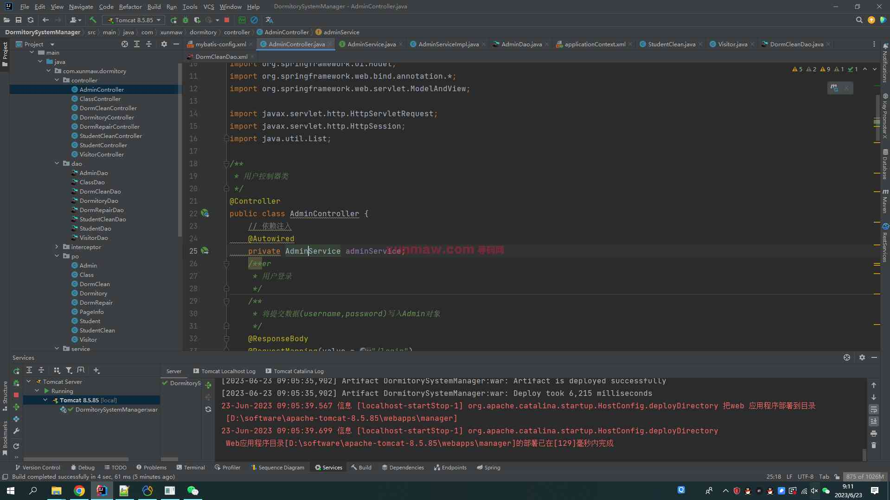 
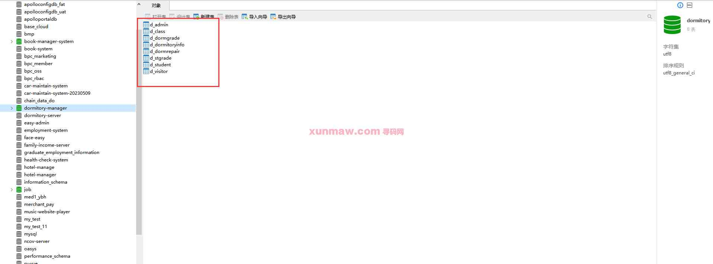  

##### 【功能详述】 
1. 登录  
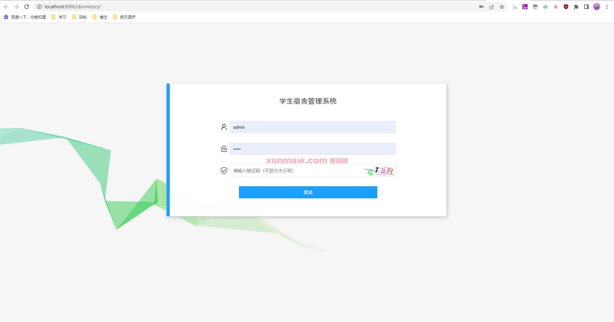

2. 首页  
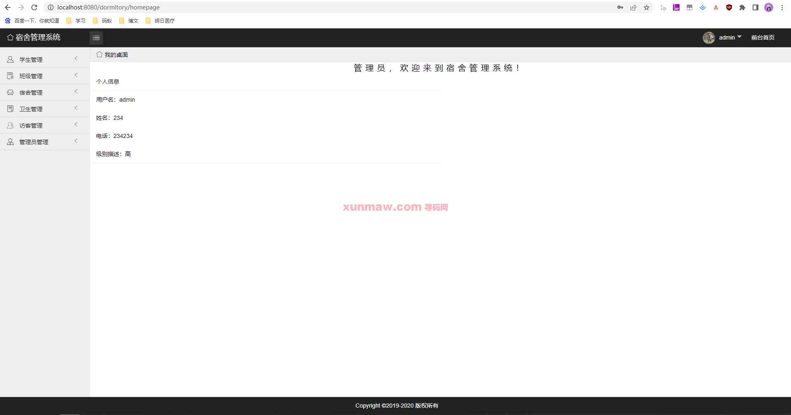

3. 学生管理-学生信息  
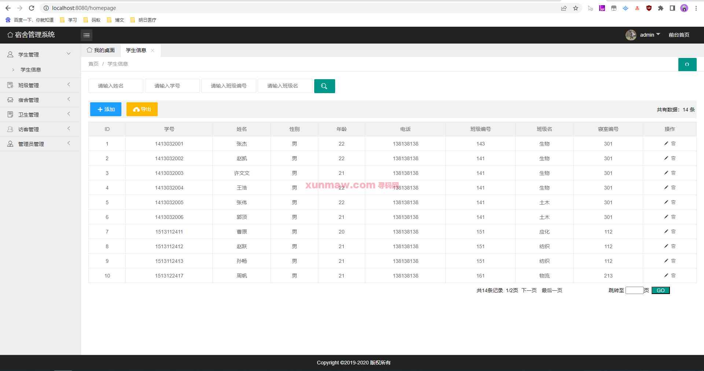

4. 班级管理-班级列表  
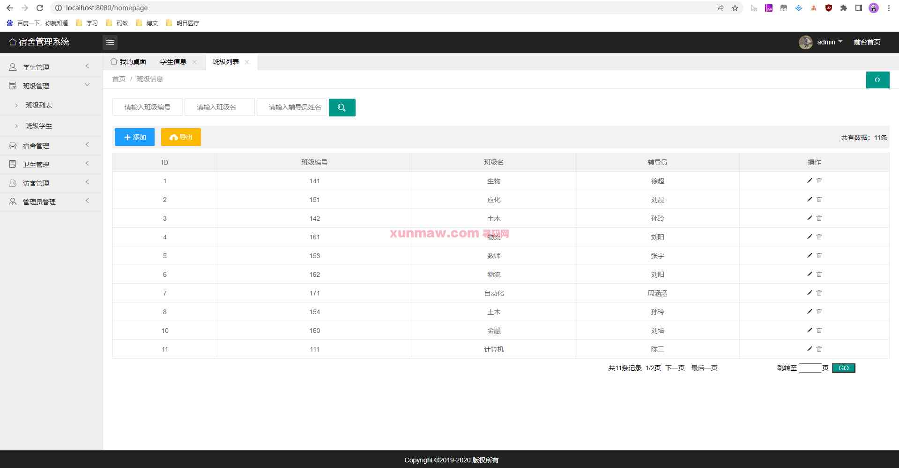

5. 班级管理-班级学生  
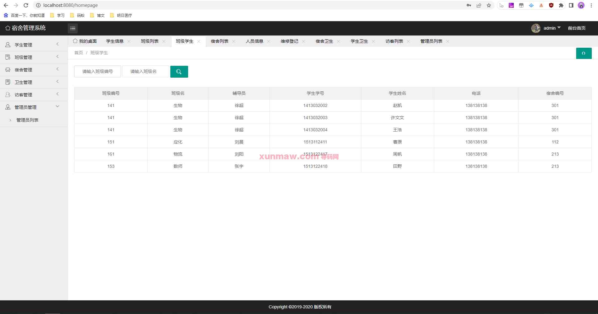

6. 宿舍管理-宿舍列表  
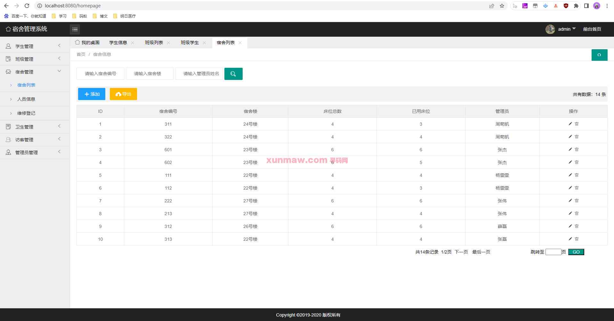

7. 宿舍管理-人员信息  
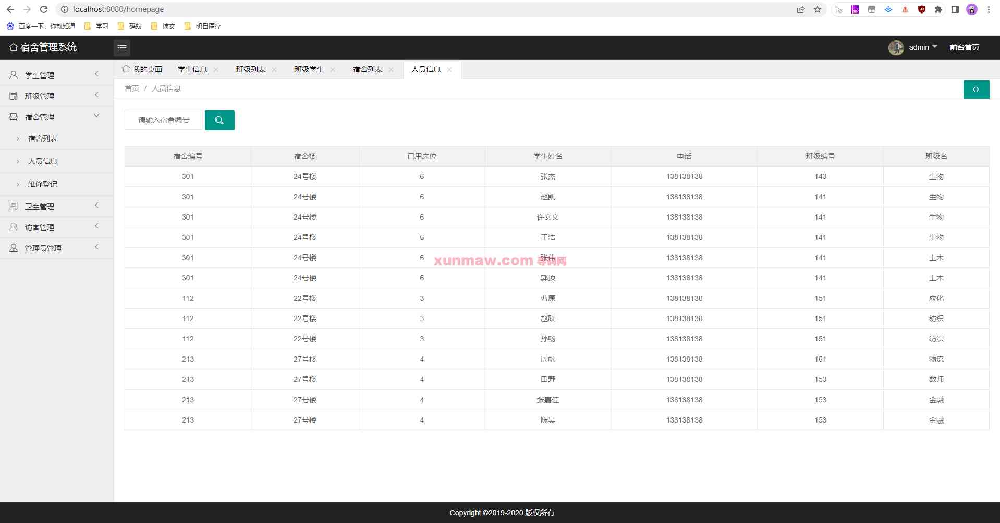

8. 宿舍管理-维修登记  
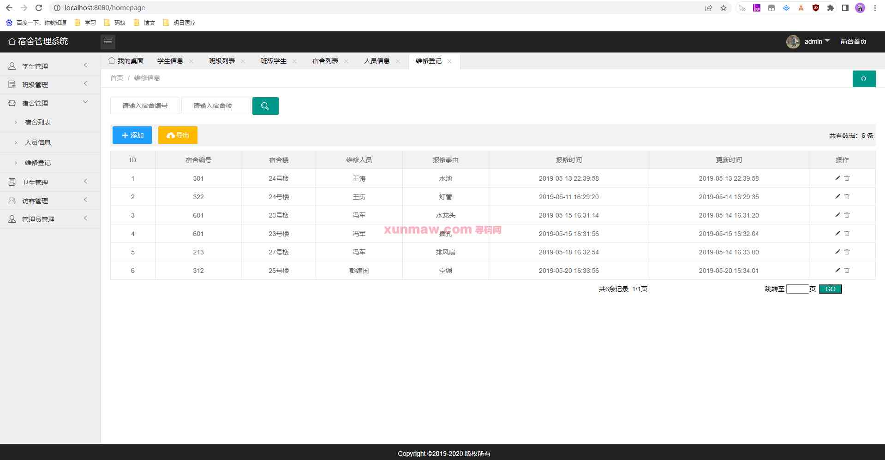

9. 卫生管理-宿舍卫生  
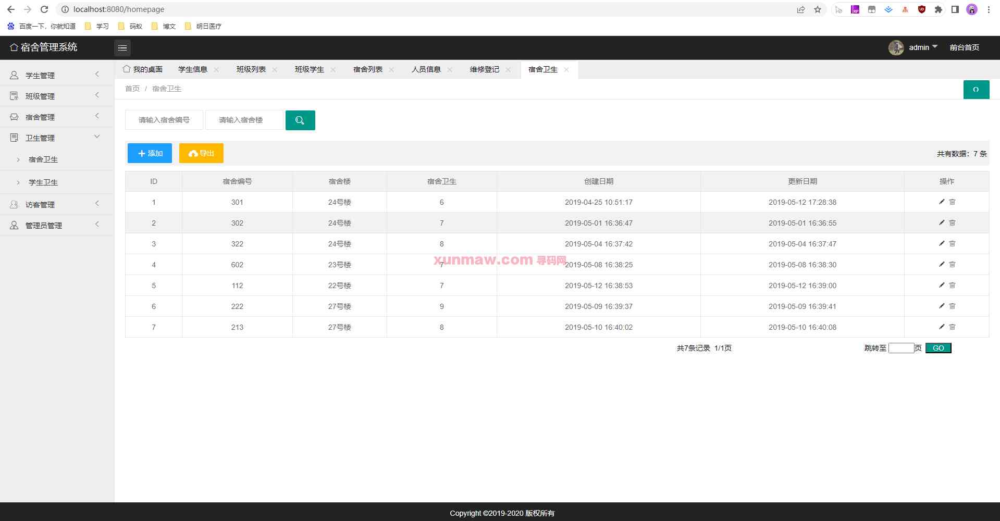

10. 卫生管理-学生卫生  
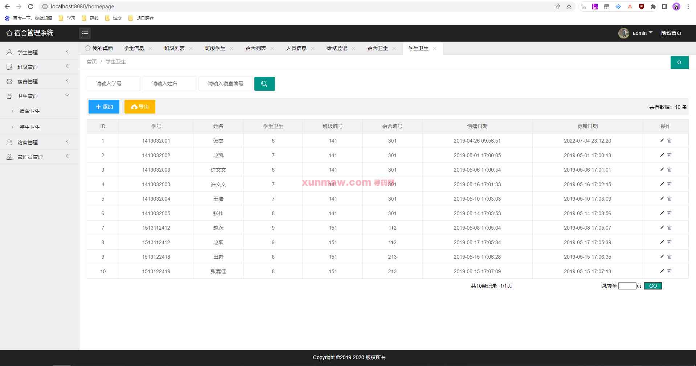

11. 访客管理-访客列表  
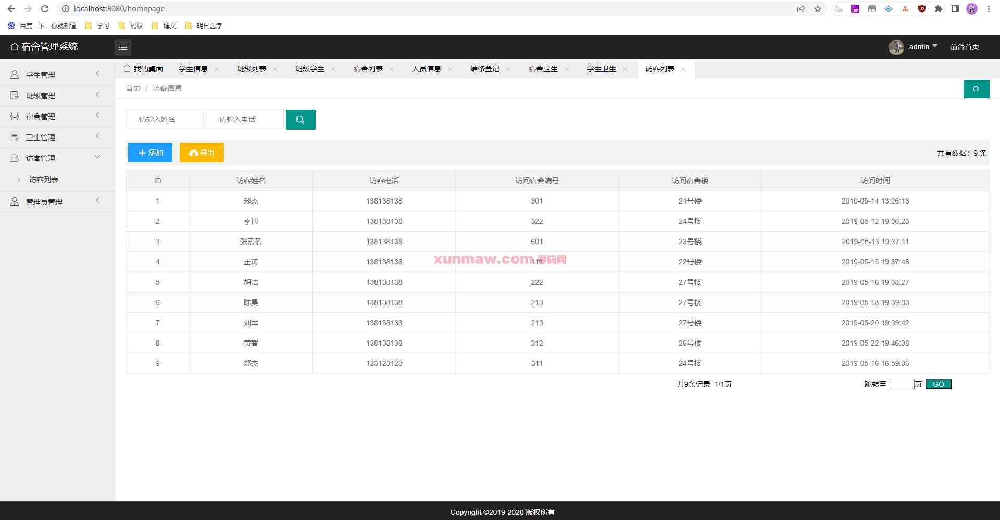

12. 管理员管理-管理员列表  
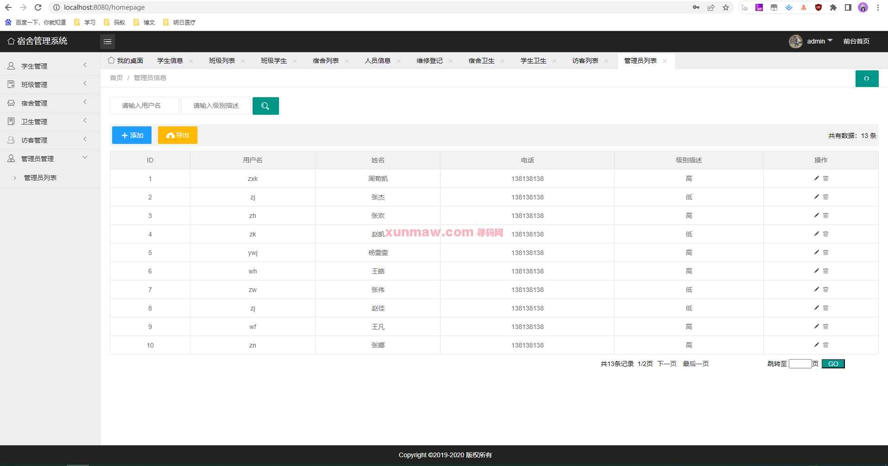
  

#### 使用说明
1. 创建数据库，执行数据库脚本  
2. 修改jdbc数据库连接参数  
3. 下载安装maven依赖jar  
4. 启动tomcat服务器部署项目  

后端管理： 
    请求地址： http://localhost:8080    
    用户名：admin    
    密码：123456    
